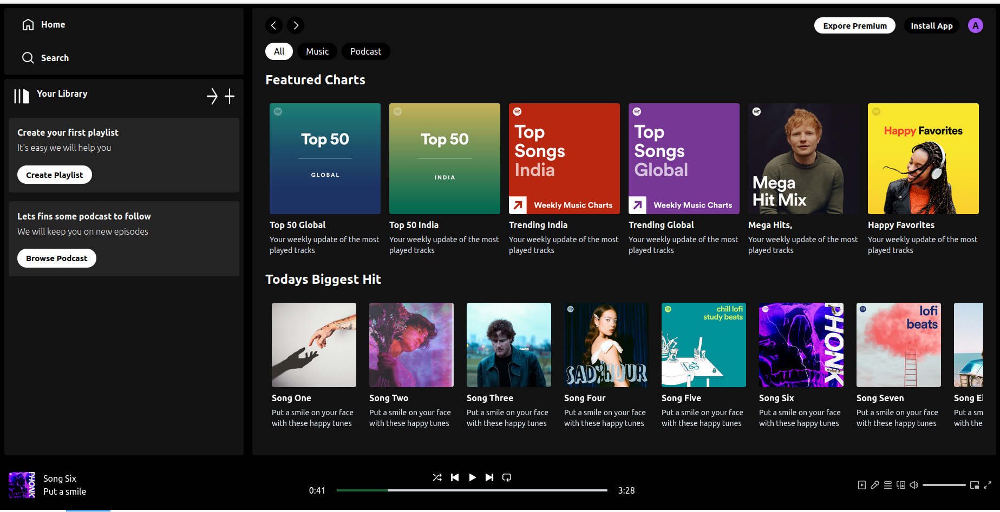

# Spotify Clone

A Spotify clone built using React and Vite.

This project is a clone of the popular music streaming service Spotify. It includes features such as music playback and more.

## Demo



## Installation

To run this project locally, follow these steps:

1. Clone the repository:
   ```bash
   git clone https://github.com/yourusername/spotify-clone.git
